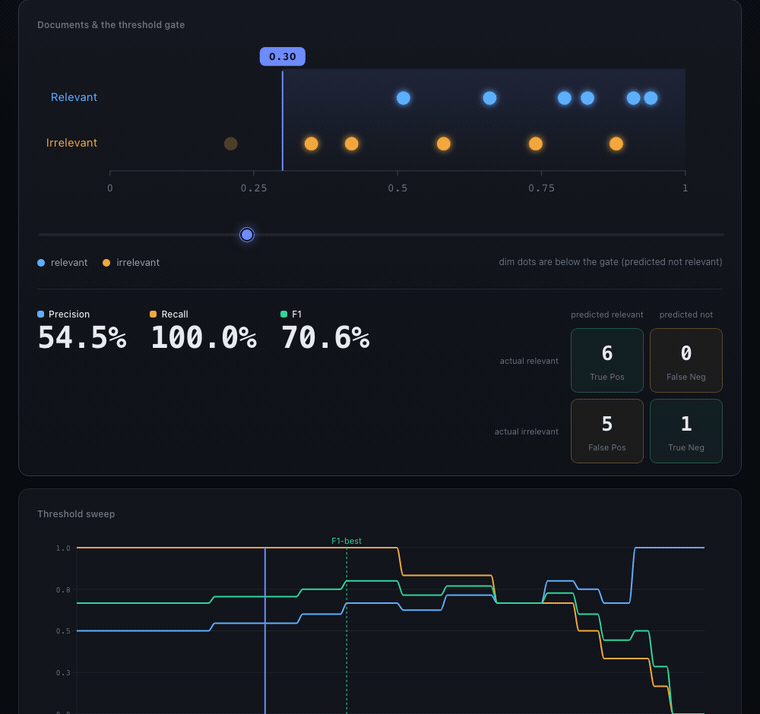

# Feel the Trade-off

An interactive, zero-backend lab for building intuition about retrieval metrics — drag a threshold and watch precision, recall, F1, and the cost-of-error trade-off update live.

[](https://feel-the-tradeoff.vercel.app)
[](https://github.com/kiransanjeevan/feel-the-tradeoff/actions/workflows/ci.yml)
[](LICENSE)

🔗 **[Open the live demo →](https://feel-the-tradeoff.vercel.app)**



## Why it exists

Precision, recall, and F1 are usually taught as static formulas, so the intuition never sticks. This lab turns them into something you manipulate directly — and adds the business-cost lens (what does a false positive cost vs. a false negative?) that decides where a real threshold should sit. It's a hands-on artifact for reasoning about RAG/search evaluation.

## What it does

- **Threshold slider** — drag it; the confusion matrix, precision, recall, and F-beta recompute live.
- **Sweep chart** — plots precision / recall / F1 across every threshold at once, so you watch the curves cross.
- **F-beta tuning** — F0.5 / F1 / F2 controls mark the optimal threshold for whichever error you care about more.
- **Cost-of-error model** — set the cost of a false positive vs. a false negative and the lab finds the cost-optimal threshold.
- **5 built-in scenarios** — PM Compass, Medical Triage, Spam Filter, Legal Discovery, Clean Separation — each with its own error-cost asymmetry.
- **Bring your own data** — upload a CSV of `(score, label)`, or type a query + documents and get real in-browser embeddings (MiniLM via transformers.js, cosine similarity). Nothing leaves the browser.

## The math is the anchor

[`src/metrics.ts`](src/metrics.ts) is a pure, framework-agnostic core with no UI dependencies. The UI never reimplements a formula — every displayed number comes from this module. It's covered by golden-value unit tests ([`src/metrics.test.ts`](src/metrics.test.ts)) spanning the threshold family (precision, recall, F-beta, sweep, PR curve), the cost-of-error model, and the @k ranking family (Precision@k, Recall@k, MRR, MAP, NDCG, Hit Rate). CI runs the full suite (44 tests) on every push.

## Tech stack

| Area | Choice |
|------|--------|
| UI | React 18 + TypeScript, Vite (static SPA, no backend) |
| Charts | Recharts (sweep / cost); hand-rolled SVG for the score axis |
| Embeddings | `@huggingface/transformers` (MiniLM, WebGPU/WASM), dynamically imported so the ML runtime is a separate chunk |
| Tests | Vitest + jsdom — 44 tests (metrics core, CSV parsing, component smoke) |
| Hosting | Vercel; relative `base` so the build also works on GitHub Pages |

All computation is client-side.

## Run locally

```bash
npm install
npm run dev        # dev server on localhost
npm test           # run the 44-test suite
npm run typecheck  # tsc --noEmit
npm run build      # production build to dist/
npm run preview    # serve the production build
```

## Project structure

```
src/
  metrics.ts            # pure metric core (tested, no UI deps)
  metrics.test.ts       # golden-value tests
  csv.ts                # CSV (score,label) parsing
  embeddings.ts         # in-browser MiniLM embeddings (dynamic import)
  presets.ts            # the 5 built-in scenarios
  theme.ts              # colorblind-safe palette
  App.tsx               # main UI
  components/           # ScoreAxis, SweepChart, CostChart, DataSourcePanel
docs/demo.gif
```

## Status

| Phase | Scope | Status |
|-------|-------|--------|
| v0.1 | Unit-tested metrics core | ✅ |
| v1.0 | Interactive MVP — slider, sweep, F-beta, cost-of-error, presets | ✅ |
| v1.5 | CSV upload + real in-browser embeddings | ✅ |
| v2.0 | PR curve, two-stage retrieval visual, full @k UI, shareable URLs, A/B compare, guided lessons | ⏳ |

## License

[MIT](LICENSE) © 2026 Kiran Sanjeevan
